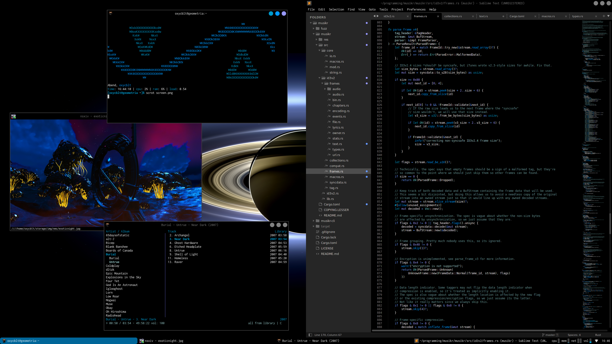

# dotfiles

Miscellanious dotfiles I cobbled together with luck and stackoverflow. Currently these are mostly useless and only
exist as a backup, but hopefully I'll make it into something more cohesive.

[screen](./screen.png)</img>

#### Goals:
- Back up configs for certain programs
- Keep track of Font/GTK configurations
- Create a nice awesomewm theme and color scheme based off of visiblue

#### Setup:

*Warning: Incomplete list, will create a full list as soon as I have to make another install*

I use Arch linux with the following programs: `nano`, `git`, `base-devel`, `yay`, `micro`, `bash`, `xorg`,
`xclip`, `awesome`, `pulseaudio`, `papirus-icon-theme`, `qt5ct`, `kvantum`, `ttf-inconsolata`,
`adobe-source-sans-fonts`, `adope-source-serif-fonts`, `inter-font`, `ttf-dejavu`, `neofetch`, `redshift`,
`bat`, `ripgrep`, `kitty`, `dex`, `renameutils`, `playerctl`, `pamixer`, `acpi`, `pavucontrol`, `exa`,
`nm-applet`, `lxtask`, `nsxiv`, `mpv`, `scrot`, `gimp`, `dex`, `capitaine-cursors`, `lightdm`, `light-locker`,
`lightdm-mini-greeter`, `firefox`, `sublime-text`
